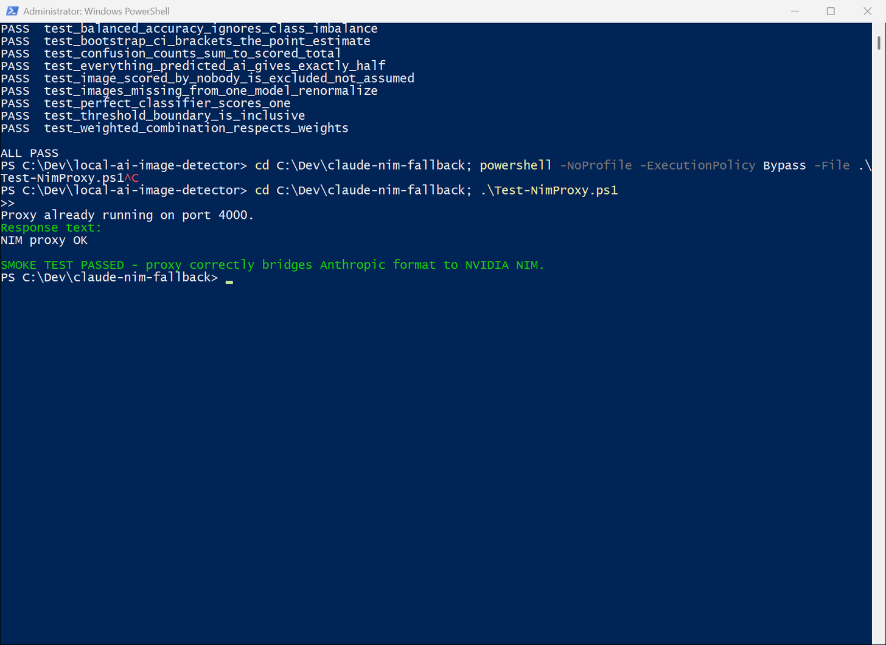

# claude-nim-fallback

[](LICENSE)



Local bridge that lets you keep using the Claude Code CLI when you've hit
your normal Claude usage limit, by routing it through free NVIDIA NIM models
instead. Claude Code only speaks Anthropic's Messages API format; NVIDIA NIM
is OpenAI-compatible. A local [LiteLLM](https://github.com/BerriAI/litellm)
proxy translates between the two, so nothing about Claude Code itself
changes - you just point it at `http://127.0.0.1:4000` instead of Anthropic.

> **Status: maintained, not superseded.** Verified working 2026-09-11
> (`Test-NimProxy.ps1` passes against the live proxy). OpenCode covers a
> different lane; this repo is for the Claude Code CLI hitting its usage
> limit, which still happens.

**This is not Claude.** It's free third-party models (Nemotron, Llama, Qwen,
DeepSeek, GLM) wearing Claude Code's interface. Tool-use reliability,
judgment, and code quality are all noticeably lower than Claude. Use it for
mechanical/scratch work to keep moving when you're blocked - not for ULC
client work, trading decisions, or anything compliance-adjacent.

## One-time setup (already done as of 2026-07-31)

- [x] NVIDIA NIM free API key obtained from https://build.nvidia.com and saved to `.env`
- [x] `litellm[proxy]==1.94.1` installed via `pip install --user` (pinned - avoid
      PyPI versions 1.82.7 and 1.82.8, which shipped credential-stealing malware)
- [x] Proxy smoke-tested end-to-end against the real NVIDIA API

If setting up fresh on another machine:
1. Get a free key at https://build.nvidia.com (sign in -> open any model ->
   "Get API Key").
2. `pip install --user "litellm[proxy]==1.94.1"`
3. `copy .env.example .env` and fill in `NVIDIA_NIM_API_KEY`.
4. Run `.\Test-NimProxy.ps1` to confirm it works before trusting it.

## Day-to-day usage

When you hit your Claude limit and want to keep working:

```powershell
cd C:\Dev\claude-nim-fallback
.\Start-ClaudeNim.ps1
```

This starts the local proxy (if not already running) and launches
`claude --model nim-nemotron-ultra-550b` pointed at it. Work as normal;
exit Claude Code as normal (`Ctrl+D` / `exit`).

Pick a different backend model:

```powershell
.\Start-ClaudeNim.ps1 -Model nim-llama3.3-70b
```

Available `-Model` values (edit `config.yaml` to add more from the
[NIM catalog](https://build.nvidia.com)):

| Model name | Backing model | Notes |
|---|---|---|
| Model name | Backing model | Notes |
|---|---|---|
| `nim-nemotron-ultra-550b` (default) | nvidia/nemotron-3-ultra-550b-a55b | **Confirmed working 2026-08-01.** Largest, thinking-mode on, full context window, best for complex/long-running work. Slow. |
| `nim-nemotron-super-120b` | nvidia/nemotron-3-super-120b-a12b | **Confirmed working 2026-08-01**, but noticeably smaller context window than Ultra in practice - fine for short bounded tasks, struggles on long back-and-forth. Faster than Ultra. |
| `nim-glm-5.2` | z-ai/glm-5.2 | **Confirmed BROKEN 2026-08-01** - every request 404s (see config.yaml comment: LiteLLM routes through OpenAI's Responses API, which NVIDIA doesn't expose for third-party-hosted models on NIM). Don't use until fixed. |
| `nim-llama3.3-70b` | meta/llama-3.3-70b-instruct | Untested |
| `nim-llama3.1-405b` | meta/llama-3.1-405b-instruct | Untested |
| `nim-qwen-coder-32b` | qwen/qwen2.5-coder-32b-instruct | Untested |
| `nim-deepseek-r1` | deepseek-ai/deepseek-r1 | Untested - may hit the same Responses-API 404 as GLM since it's also third-party-hosted, not NVIDIA's own model |
| `nim-uncensored-selfhost` | your Kaggle T4 via cloudflared | **Not NIM.** Abliterated model on your own GPU. Endpoint read at startup from the `uncensored-llm` MCP server's `endpoint_state.json`; the entry is dropped if nothing is registered. Untested as of 2026-08-24. |
| `nim-uncensored-hosted` | abliteration.ai free tier | **Not NIM, and a third party.** Read from that MCP server's `.env`. No DPA - never send client data, personal info, or anything POPIA-covered. Untested as of 2026-08-24. |

### About the two uncensored entries

They exist so a whole Claude Code session can run against an abliterated
model rather than one MCP call at a time. Built 2026-08-24 alongside the
`uncensored-llm-mcp` project in `projects/ulc-mcp-suite/`.

**Tool use works.** Abliteration does not degrade tool calling, function
calling, or structured output - capability preservation is exactly what the
KL-divergence figure measures - and Gemma 4 ships native function calling
trained in from scratch. What it depends on is `llama-server` running with
`--jinja`; the Kaggle notebook passes it. If tool calls come back malformed,
check that flag before blaming the weights.

**You may not need this proxy at all.** Recent `llama-server` speaks the
Anthropic Messages API directly, so pointing `ANTHROPIC_BASE_URL` at the
tunnel works with no LiteLLM in the path. Use these entries when you want one
place to switch between the NIM models and the uncensored ones.

The proxy keeps running in the background across sessions (hidden process,
logs in `logs\`). Stop it when you're done to free the port / avoid it
sitting there idle:

```powershell
.\Stop-NimProxy.ps1
```

## Switching back to real Claude

`Start-ClaudeNim.ps1` only sets `ANTHROPIC_BASE_URL` / `ANTHROPIC_AUTH_TOKEN`
for its own process and the `claude` child process it launches - it does not
touch your normal environment. Just open a normal terminal and run `claude`
as usual; nothing here persists globally. If you ever explicitly export
those vars into a shell yourself, `Remove-Item Env:\ANTHROPIC_BASE_URL` /
`Env:\ANTHROPIC_AUTH_TOKEN` undoes it in that shell.

## Files

- `config.yaml` - LiteLLM proxy model routing (NIM model catalog -> local names)
- `.env` - real secrets (git-ignored). `.env.example` is the template.
- `_EnsureProxy.ps1` - shared helper: loads `.env`, starts/health-checks the proxy
- `Start-ClaudeNim.ps1` - main entrypoint: ensure proxy up, launch `claude`
- `Test-NimProxy.ps1` - non-interactive smoke test (no Claude Code needed)
- `Stop-NimProxy.ps1` - kill the background proxy process
- `logs\` - proxy stdout/stderr + pid file (git-ignored)

## Known limitations

- Free NIM tier is rate-limited (roughly 40 req/min) - expect throttling
  under heavy agentic tool-call loops.
- No Anthropic prompt caching - every request re-sends full context, so
  it's slower and each request does more raw work than a cached Claude call.
- Extended-thinking-style output (`reasoning_content`) from the Nemotron
  models comes through as separate `thinking` content blocks in the
  Anthropic-format response; Claude Code should render it, but treat any
  weirdness there as an upstream LiteLLM/format quirk, not a real bug in
  your work.
- This is a community pattern (LiteLLM's Anthropic-format pass-through), not
  an Anthropic-supported feature. If a Claude Code update changes how it
  talks to gateways, this may need adjustment.

## Development

```powershell
.\Test-NimProxy.ps1
```

Non-interactive smoke test: starts the proxy if needed and checks it
bridges Anthropic format to NVIDIA NIM. Needs the real API key in `.env`
(a live call, not a mock), so there is no CI workflow — this script is the
check. Verified passing 2026-09-11.

## License

MIT. See [LICENSE](LICENSE).
